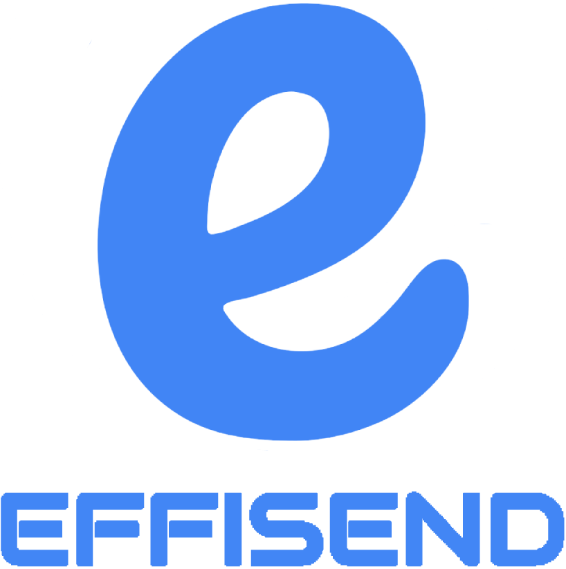
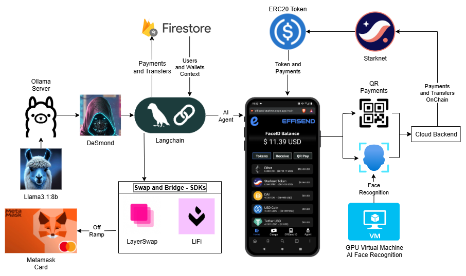
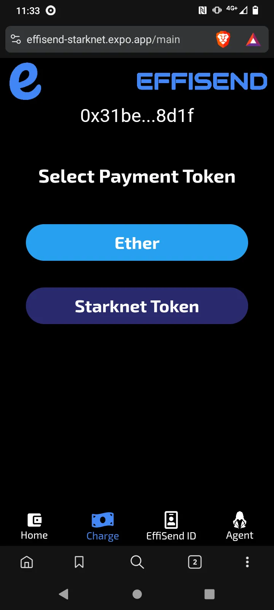
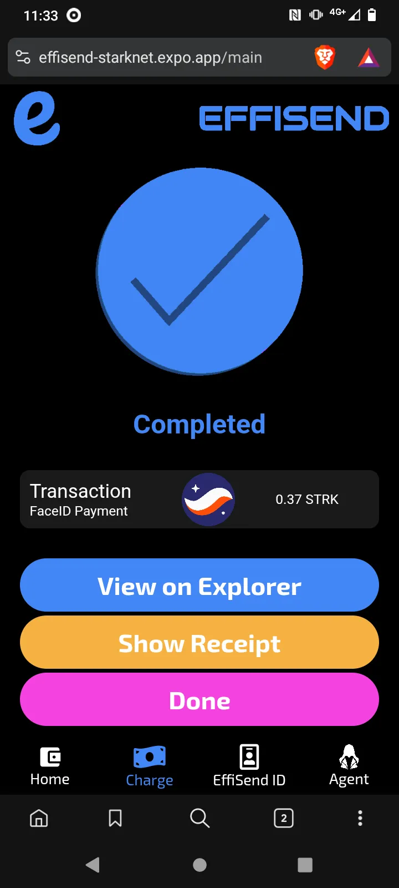
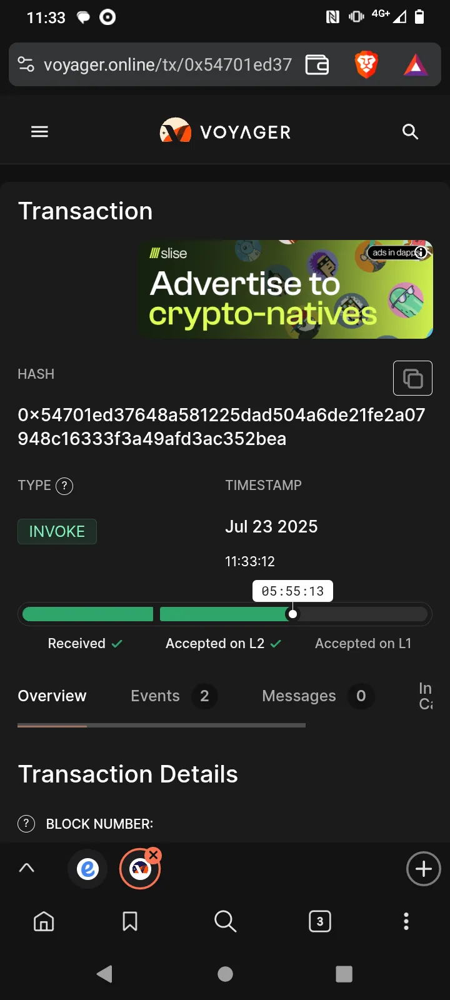
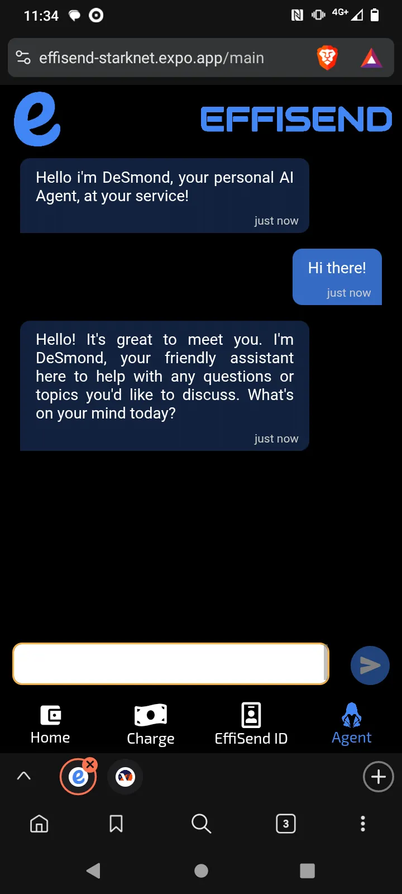
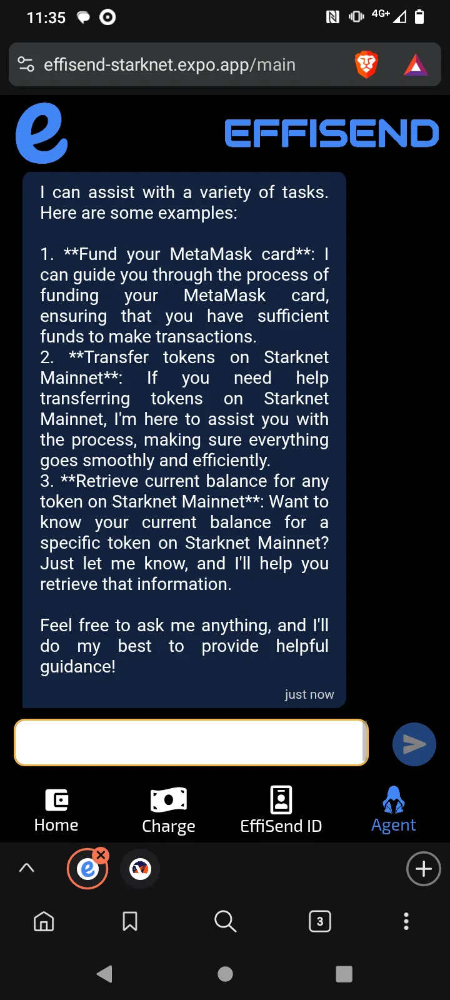
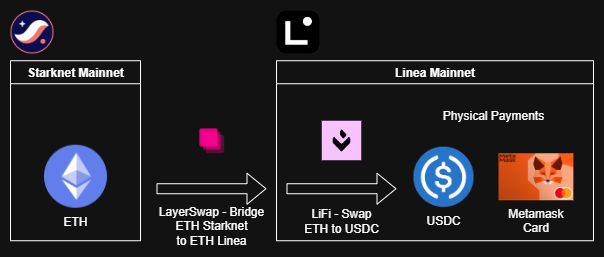

# EffiSend-Starknet

<p align="center">

<p>

EffiSend is a cutting-edge identity and payments platform built on Starknet. It combines AI-powered Face-ID biometrics with an AI-driven agent for secure, seamless identity and finance management. By tokenizing verified interactions and ecosystem participation, EffiSend bridges trust, finance, and incentives—unlocking a new era of user engagement and rewards.

## ⚡Fast Links:

APP CODE: [CODE](./effisend-starknet/)

WEB DAPP: [LINK](https://effisend-starknet.expo.app)

VIDEODEMO: [LINK](pending...)

<hr>

## 🚀 System Diagram

EffiSend is built entirely from scratch to leverage the most advanced web3 infrastructure.




  - [**STRK**](https://starknet.io/)
    The main token used to interact with Starknet services and track user rewards. STRK is the native token of the Starknet ecosystem, enabling fast, secure, and decentralized transactions.

  - [**Starknet**](https://starknet.io/)
    Serves as the main blockchain powering EffiSend transactions and rewards distribution. This ZK-Rollup offers massive scalability and low fees, making it ideal for scalable token transfers and automated operations tied to STRK.

  - [**Langchain (AI Agent)**](https://lanchain.com/)
    This framework enables us to create our agent system and its interaction with the user through DeSmond. It allows EffiSend to facilitate Straknet native transfers, perform an off-ramp to our MetaMask card.

  - [**DeepFace**](https://viso.ai/computer-vision/deepface/)
    DeepFace is used to enhance facial recognition capabilities with real-time verification and anti-spoofing features. By cross-validating identity against secure embeddings, it boosts biometric reliability, ensuring that wallet access and reward claiming remain both frictionless and secure.

## 💲STRK:

A key component of our application is the utilization of STRK as the primary token, largely due to its seamless integration with the Starknet. Furthermore, we employ STRK as the primary token for payments and as rewards for users on the Starknet network.

### Payments:

For the use case of payments, STRK offers a convenient way to make blockchain-based payments in Mexican pesos, as it is the primary token on Starknet and performing operations is relatively straightforward.

  

  - Crypto Payment Main Code.

    ```javascript
    let query = await Accounts.where("user", "==", req.body.user).get();
    if (query.empty) {
        throw "BAD USER"
    }
    const { address, privateKey } = query.docs[0].data();
    const account = new Account(provider, address, privateKey);
    const transferAmount = cairo.uint256(parseFloat(req.body.amount) * 10 ** tokens[req.body.id].decimals); // Id and amount is sended on the request
    const contract = new Contract(
        compiledSierra.abi,
        tokens[req.body.id].address,
        provider
    )
    const transferCall = contract.populate("transfer", {
        recipient: req.body.to, // To is received address on the request
        amount: transferAmount,
    });
    let transaction = await account.execute(transferCall);
    console.log({ hash: transaction.transaction_hash })
    res.send({
        error: null,
        res: {
            hash: transaction.transaction_hash
        }
    });
    ```

Making a payment with a token on Starknet is straightforward. This interface enables us to facilitate all the payments requested by the user. In the case of EffiSend, these payments are executed after a successful facial recognition or by scanning a QR code (like Alipay). The details of these processes will be outlined later.

<hr>

### Rewards:

As a platform built on identity, we follow the rewards model of Worldcoin, which rewards users for utilizing the platform and signing up. So, every time a user completes a certain number of transactions or actions, they receive a reward in STRK tokens.

Instead of deploying a custom rewards contract, we utilize Starknet's native allowance mechanism (`approve`/`increase_allowance`). Our central Token Distribution Account authorizes a specific amount of STRK for the user, which they can then claim.

Our Trust Score algorithm is based on the user's on-chain activity. We use the wallet's `nonce` (the number of executed transactions) on Starknet as a direct measure of their interaction with the ecosystem. A higher nonce indicates a more active and trustworthy user, which can lead to better recommendations and rewards in the future.

  - The first reward for creating an account. We use the `increase_allowance` function from our distribution account to grant rewards.

    ```javascript
    ...
    const contract = new Contract( // ETH Contract
      compiledSierra.abi,
      "0x049d36570d4e46f48e99674bd3fcc84644ddd6b96f7c741b1562b82f9e004dc7",
      provider
    )
    const contractSTRK = new Contract( // STRK Contract
      compiledSierra.abi,
      "0x04718f5a0Fc34cC1AF16A1cdee98fFB20C31f5cD61D6Ab07201858f4287c938D",
      provider
    )
    ...
    // Fund the account
    const transferAmount = cairo.uint256(0.000003 * 10 ** 18);
    const { transaction_hash: tx_transfer } = await contract.transfer(OZcontractAddress, transferAmount)
    await provider.waitForTransaction(tx_transfer);
    console.log({ tx_transfer })
    // Next Step - Deploy Account
    const account = new Account(provider, OZcontractAddress, privateKey);
    const { transaction_hash: tx_deploy } = await account.deployAccount({
        classHash: OZaccountClassHash,
        constructorCalldata: OZaccountConstructorCallData,
        addressSalt
    });
    await provider.waitForTransaction(tx_deploy);
    console.log({ tx_deploy })
    // Send Rewards
    const { transaction_hash: tx_rewards } = await contractSTRK.approve(
        OZcontractAddress,
        parseUnits("0.01", 18) // 0.01 STRK at the moment POC
    );
    console.log({ tx_rewards })
    await provider.waitForTransaction(tx_rewards);
    ```

This allowance-based system is gas-efficient and secure, leveraging Starknet's native features to manage rewards without the overhead of a custom contract.

## 🌐 Starknet:

As seen in the provided code snippets, Starknet plays a direct and critical role in EffiSend's core functionalities:

  - **STRK Token Transfers**: When STRK tokens are transferred between user wallets like the rewards system, these are real blockchain transactions executed on the Starknet network.
 
  - **Trust Score via Nonce**: To enhance platform integrity and user rewards, we've implemented a Trust Score based on each user's on-chain activity. We fetch the `nonce` of the user's Starknet account, which represents the total number of transactions they have executed. A higher nonce signifies greater engagement with the ecosystem, contributing to a higher trust score and unlocking better benefits within EffiSend.

## FaceID Payment

EffiSend enables seamless payments via facial recognition by linking a user’s unique biometric profile to their wallets.

  

  - The primary function is to create a new user or locate an existing one. This process is dedicated solely to validation, ensuring that the system remains secure and isolated from other services.

    ```python
    @app.post("/fetchOrSave", dependencies=[Depends(check_api_key)])
    async def findUser(item: ItemUserFace):
    # Define a function to handle image processing and facial recognition
    def process_image(image_data):
        # Save image to temporary file
        temp_file = TEMP_DIR / f"{os.urandom(32).hex()}.jpg"
        with open(temp_file, "wb") as f:
            f.write(base64.b64decode(image_data))

        # Perform facial recognition
        try:
            result = DeepFace.find(img_path=temp_file, db_path=DB_DIR, anti_spoofing=True)
            return result[0].identity[0].split('.')[0].split('/')[2]
        except Exception as e:
            return False
        finally:
            # Remove temporary file
            temp_file.unlink()

    # Define a function to handle database operations
    def save_image(image_data, nonce):
        image = Image.open(BytesIO(base64.b64decode(image_data)))
        image.save(DB_DIR / f"{nonce}.jpg")
        return True

    # Process image and facial recognition
    result = process_image(item.image)
    if result:
        return {"result": result}
    else:
        # Save image to database
        save_image(item.image, item.nonce)
        return {"result": True}
    ```

  - The second function exclusively conducts a user search through facial recognition, retrieving only the user data.

    ```python
    @app.post("/fetch", dependencies=[Depends(check_api_key)])
    async def findUser(item: ItemFind):
      # Define a function to handle image processing and facial recognition
      def process_image(image_data):
          # Save image to temporary file
          temp_file = TEMP_DIR / f"{os.urandom(32).hex()}.jpg"
          with open(temp_file, "wb") as f:
              f.write(base64.b64decode(image_data))

          # Perform facial recognition
          try:
              result = DeepFace.find(img_path=temp_file, db_path=DB_DIR, anti_spoofing=True)
              return result[0].identity[0].split('.')[0].split('/')[2]
          except Exception as e:
              return False
          finally:
              # Remove temporary file
              temp_file.unlink()

      # Process image and facial recognition
      result = process_image(item.image)
      print(result)
      if result:
          return {"result": result}
      else:
          return {"result": False}
    ```
<hr>

## 🤖 AI Agent (DeSmond):

The EffiSend platform incorporates an AI agent named DeSmond, built using the Langchain framework. DeSmond is capable of understanding and responding to natural language inputs, allowing users to interact with the platform in a more conversational and intuitive way. DeSmond can perform various tasks, such as crypto transfers and Metamask top-ups from your ETH balance.

  

### Agent Setup and Tools

DeSmond utilizes several specialized tools to handle different user requests. These tools are integrated into a graph-based workflow, allowing for conditional execution based on the user's intent.

**Available Tools:**

Okay, here is the provided text described using the identified Markdown formatting elements:

  - **`transfer_tokens`**: Facilitates token transfers on Starknet Mainnet.

    ```javascript
    // Transfer Tokens
    const transferTokens = tool(
      async ({ amount, to, token }, { configurable: { user } }) => {
        const response = await fetchURL(process.env.EXECUTE_PAYMENT_API, {
          user,
          amount,
          id: tokens.findIndex((tokenTemp) => tokenTemp.symbol === token),
          to,
        });
        if (response === null) {
          return JSON.stringify({
            status: "error",
            message: "Transaction failed.",
          });
        }
        const { hash } = response;
        return JSON.stringify({
          status: "success",
          message: "Transaction created and available on Starknet Mainnet.",
          transaction: hash,
        });
      },
      {
        name: "transfer_tokens",
        description: `This tool facilitates Tokens transfers on the Starknet Mainnet. It generates the transaction data for the user to sign. It activates whenever the user explicitly requests to send Tokens, initiates a transaction, or mentions terms like 'transfer,' 'Tokens,' or 'Starknet Mainnet' in relation to their wallet activity.
          
          This is the list of available tokens: ${tokens.map(
            (token) => `${token.symbol}, `
          )}
          `,
        schema: z.object({
          amount: z.string(),
          to: z.string(),
          token: z.string(),
        }),
      }
    );
    ```

  - **`get_balance_starknet`**: Retrieves the user's current token balance on Starknet Mainnet.

    ```javascript
    // Get Native Balance - Modified for API response
    const getBalanceTokens = tool(
      async ({ token }, { configurable: { address } }) => {
        console.log("Get Balance Tool invoked with token:", token);
        const tokenSelected = tokens.find(
          (tokenTemp) => tokenTemp.symbol === token
        );
        const contract = new Contract(abiERC20, tokenSelected.address, provider);
        const balance = await contract.balanceOf(address);
        let finalBalance = formatUnits(balance, tokenSelected.decimals);
        finalBalance = epsilonRound(finalBalance);
        return JSON.stringify({
          status: "success",
          balance: `${finalBalance} ${tokenSelected.symbol}`,
        });
      },
      {
        name: "get_balance_starknet",
        description: `This tool retrieves the user's current X token balance, where X is any token on Starknet Mainnet. Use this when the user specifically asks for their token balance, 'token', "balance", or general wallet funds on Starknet Mainnet.
          
          This is the list of available tokens: ${tokens.map(
            (token) => `${token.symbol}, `
          )}
          `,
        schema: z.object({
          token: z.string(),
        }),
      }
    );
    ```

  - **`web_search`**: Facilitates precise and comprehensive internet searches.

    ```javascript
    // Web Search Tool - Modified for API response
    const webSearch = tool(
      async ({ query }) => {
        console.log("Web Search Tool invoked with query:", query);
        try {
          const res = await webSearchTool.invoke("what is the current weather in sf?"); // Assuming webSearchTool has an invoke method
          console.log("Web Search Tool results:", res);
          return JSON.stringify({ status: "success", query, results: res });
        } catch (error) {
          console.error("Web Search Tool error:", error);
          return JSON.stringify({ status: "error", message: error.message });
        }
      },
      {
        name: "web_search",
        description:
          "This tool facilitates precise and comprehensive internet searches, enabling users to gather current and detailed information about specific topics or queries. It activates when users explicitly request a web search or need up-to-date insights, especially when inquiring about the identity or role of individuals or entities, such as 'Who is the current Founder of Starknet?' or any other general inquiries requiring internet-sourced information.",
        schema: z.object({
          query: z.string(),
        }),
      }
    );
    ```

  - **`list_of_tools`**: Provides a list of available tools for the user to interact with.

    ```javascript
    // List of Tools - Modified for API response
    const listOfTools = tool(
      () => {
        console.log("List of Tools Tool invoked.");
        return JSON.stringify({
          status: "info",
          message:
            "DeSmond can help you fund your MetaMask card, transfer tokens on Starknet Mainnet, and retrieve your current balance for any token on Starknet Mainnet.",
        });
      },
      {
        name: "list_of_tools",
        description:
          "This tool provides a list of available tools for the user to interact with. It activates whenever the user explicitly requests information about available tools, mentions terms like 'tools,' 'features,' or 'commands'. Or more generally, whenever the user wants to know what DeSmond can do.",
        schema: z.object({}),
      }
    );
    ```

  - **`fallback`**: Activates when the user greets the assistant with a simple "hi" or "hello" and asks for help.

    ```javascript
    // Fallback Tool - Modified for API response
    const fallbackTool = tool(
      () => {
        console.log("Fallback Tool invoked.");
        return JSON.stringify({
          status: "info",
          message:
            "As stated above, say something friendly and invite the user to interact with you.",
        });
      },
      {
        name: "fallback",
        description:
          "This tool activates when the user greets the assistant with a simple 'hi' or 'hello' and asks for help. It provides a friendly and welcoming message to initiate the conversation.",
        schema: z.object({}),
      }
    );
    ```

### Special Method: MetaMask Card Top-Up

To fund a MetaMask card, EffiSend uses a multi-step process that bridges assets from Starknet to the Linea network. This is activated when a user requests to send STRK to their MetaMask card. The process leverages Layerswap for cross-chain bridging and Li.Fi for swapping assets on the destination chain.



  - **`fund_metamask_card`**: Facilitates transfers of Starknet ETH to USDC on Linea (MetaMask Card).

    ```javascript
    // Transfer STarknet ETH to USDC on Linea (MetaMask Card) - Modified to return transaction data to API
    const fundMemamaskCard = tool(
      async ({ amount, to }, { configurable: { user } }) => {
        const response = await fetchURL(process.env.TOP_UP_PAYMENT_API, {
          user,
          amount,
          to,
        });
        if (response === null) {
          return JSON.stringify({
            status: "error",
            message: "Transaction failed.",
          });
        }
        const { hash } = response;
        return JSON.stringify({
          status: "success",
          message: "Transaction created and available on your MetaMask Card.",
          transaction: hash,
        });
      },
      {
        name: "fund_metamask_card",
        description:
          "This tool facilitates transfers where the specified amount is in USD, but the sending token is ETH on the Starknet Mainnet to USDC on Linea. It generates transaction data for the user to sign and activates when the user explicitly opts to send USD to a MetaMask Card or mentions relevant terms such as 'transfer,' 'ETH,' 'Starknet Mainnet,' or 'MetaMask Card' in the context of wallet activity.",
        schema: z.object({
          amount: z.string(),
          to: z.string(),
        }),
      }
    );
    ```

  - Code to convert STRK on Starknet to USDC on Linea.

    ```javascript
    const { address: starknetPublicKey, privateKey: starknetPrivateKey } = query.docs[0].data();
    const accountStarknet = new Account(
        providerStarknet,
        starknetPublicKey,
        starknetPrivateKey
    );
    const price = await getPrice("ethereum");
    const amount = epsilonRound(req.body.amount / price, 18);
    if(req.body.amount < 0.3){
        throw "Too Low Conversion"
    }
    const lineaAddress = req.body.to;
    console.log(publicKeyLinea)
    const proxyAccountBalance = await providerLinea.getBalance(publicKeyLinea);
    // First Quote Starknet ETH to Linea ETH to Get
    let quoteStarkToLinea = await quoteSwap({ amount, ...quoteStarknet }); // Amount with decimals, Eg. 0.01
    // Original Amount Out
    const quotedAmountOut = quoteStarkToLinea.data.quote.min_receive_amount;
    // First Quote Linea ETH to Linea USDC
    let quoteLineaSwap = await getQuote({
        ...quoteLinea,
        fromAmount: parseEther(amount.toString()),
        toAddress: lineaAddress,
    });
    // Gas Fee on Linea
    const gasFeeLinea = quoteLineaSwap.estimate.gasCosts[0].amount;
    console.log(`Amount In: ${amount} ETH (${amount * price} USD)`);
    console.log(
        `Starknet ETH to Linea ETH Fee: ${quoteStarkToLinea.data.quote.total_fee} ETH (${quoteStarkToLinea.data.quote.total_fee_in_usd} USD)`
    );
    // Final Quote Linea ETH to Linea USDC
    quoteLineaSwap = await getQuote({
        ...quoteLinea,
        toAddress: lineaAddress,
        fromAmount: parseEther(quotedAmountOut.toString()) - BigInt(gasFeeLinea),
    });
    // Check Linea Gas Fee
    const finalGasFeeLinea = quoteLineaSwap.estimate.gasCosts[0].amount;
    if (formatEther(finalGasFeeLinea) * price > 0.3) {
        console.log(
            `Gas Fee on Linea: ${formatEther(finalGasFeeLinea)} ETH (${formatEther(finalGasFeeLinea) * price
            } USD)`
        );
        throw new Error("Gas Fee on Linea too high");
    }
    // Execute Starknet ETH to Linea ETH
    const swapStarkToLinea = await createSwap({
        ...quoteStarknet,
        amount: amount,
        source_address: starknetPublicKey,
        destination_address: publicKeyLinea,
    });
    const transactionBridge = await accountStarknet.execute(
        JSON.parse(swapStarkToLinea.data["deposit_actions"][0].call_data)
    );
    console.log(
        `https://voyager.online/tx/${transactionBridge.transaction_hash}`
    );
    await providerStarknet.waitForTransaction(transactionBridge.transaction_hash);
    console.log(
        `Starknet ETH to Linea ETH Amount Out: ${quoteStarkToLinea.data.quote.min_receive_amount
        } ETH (${quoteStarkToLinea.data.quote.min_receive_amount * price} USD)`
    );
    // Wait Until Linea ETH arrives
    await new Promise((resolve) => {
        const interval = setInterval(async () => {
            const balance = await providerLinea.getBalance(publicKeyLinea);
            if (balance > proxyAccountBalance) {
                clearInterval(interval);
                resolve();
            }
        });
    }, 1000);
    // Execute Linea ETH to Linea USDC
    const amountOut = quoteLineaSwap.estimate.toAmountMin;
    console.log(
        `Linea ETH to Linea USDC Amount In: ${quoteStarkToLinea.data.quote.min_receive_amount
        } ETH (${quoteStarkToLinea.data.quote.min_receive_amount * price} USD)`
    );

    console.log(
        `Linea ETH to Linea USDC Fee: ${formatEther(finalGasFeeLinea)} ETH (${formatEther(finalGasFeeLinea) * price
        } USD)`
    );
    const routeLineaSwap = convertQuoteToRoute(quoteLineaSwap);
    const transactionSwap = routeLineaSwap.steps[0].transactionRequest;
    const resultSwap = await wallet.sendTransaction(transactionSwap);
    //await resultSwap.wait();
    console.log(`https://lineascan.build/address/${resultSwap.hash}`);
    console.log(`Amount Out: ${formatUnits(amountOut, 6)} USDC`);
    res.send({
        error: null,
        res: {
            address: lineaAddress,
            hash: resultSwap.hash
        }
    });
    ```